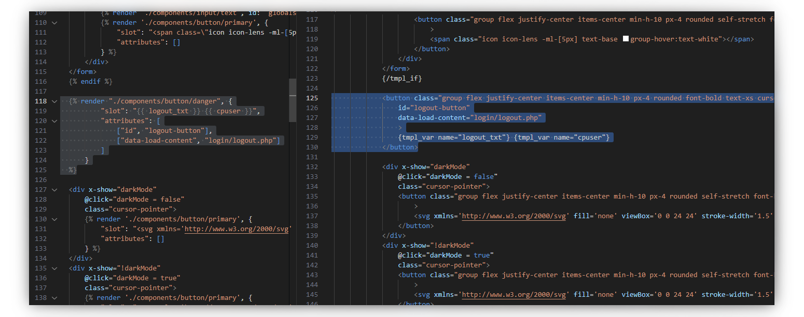

> [!WARNING]
> This is a work in progress. It's not finished yet.
> The documentation below may be incorrect or incomplete.

# 💧 `Liquidish`

[](https://github.com/luttje/liquidish/actions/workflows/tests.yml)
[](https://coveralls.io/github/luttje/liquidish?branch=main)
[](https://www.npmjs.com/package/liquidish)

This variant of [Liquid](https://shopify.github.io/liquid/) was created to compile Liquid-like syntax to another templating language. It was created to compile to ISPConfig's `tpl` syntax, seeing how it does not have proper IDE support and is not as flexible as Liquid.

> [**🔭 Check out `luttje/ispconfig-tailwind-theme`**](https://github.com/luttje/ispconfig-tailwind-theme) for an example of how this package can be used.



## 🚀 Using Liquidish

Liquidish is designed to work with [Vite](https://vitejs.dev/), but it can be used with any build tool that allows transforming files *(e.g: Webpack and Rollup)*.

We'll assume you have a Vite project set up. If not, you can create one with `npm init vite@latest`.

1. Install [this package](https://www.npmjs.com/package/liquidish) in your project:

    ```bash
    npm i -D liquidish
    ```

    *Seeing how you will be using this in your bundler, you should likely install it as a dev dependency.*

2. Create a bunch of `.liquid` files you want to compile, e.g: `src/templates`.

    > See the [📚 Liquidish Syntax](./docs/liquidish-syntax.md) for the syntax.

3. We use the [`vite-plugin-static-copy`](https://www.npmjs.com/package/vite-plugin-static-copy) to copy the `.liquid` files to the `templates` directory. Install it with:

    ```bash
    npm i -D vite-plugin-static-copy
    ```

4. Modify your `vite.config.js` to include the Liquidish transformer:

    ```javascript
    import { resolve } from 'path';
    import { defineConfig } from 'vite';
    import { viteStaticCopy } from 'vite-plugin-static-copy';
    import { ISPConfigTransformationStrategy } from 'liquidish/strategies';
    import { LiquidishTransformer } from 'liquidish';

    // Where the `.liquid` files are located
    const srcTemplatesPath = 'src/templates';

    // Create a transformer and specify the strategy
    // This example transforms the Liquidish syntax to ISPConfig's `tpl` syntax
    const liquidish = new LiquidishTransformer({
      strategyBuilder: (transformer) => new ISPConfigTransformationStrategy(transformer)
    });

    export default defineConfig({
      // ...
      plugins: [
        viteStaticCopy({
          targets: [
            {
              src: `${srcTemplatesPath}/**/*.liquid`,
              dest: 'templates',

              transform: (contents, path) => liquidish.transform(contents, path),

              rename: function (name, ext, fullPath) {
                const path = fullPath.replace(resolve(__dirname, srcTemplatesPath), '');

                // Rename the extension to what you want.
                // In our case ISPConfig expects `.htm` files
                return path.replace(/\.liquid$/, '.htm');
              },
            },
          ],
        }),
      ],
    });
    ```

5. Run Vite:

    ```bash
    npm run dev
    ```

*🎉 The `.liquid` files will now be transformed to `.htm` files in the `templates` directory.*

> ### Next steps
>
> - **[📚 Learn about the Liquidish Syntax](./docs/liquidish-syntax.md)**
>
> - **[🗺 Discover the ISPConfig or PHP transformation strategies](./docs/transformation-strategies.md)**.
>
> - **Check out one of these VSCode extensions** for Liquid syntax highlighting and other language features:
>   - [Alternative extension](https://marketplace.visualstudio.com/items?itemName=sissel.shopify-liquid)
>   - [Official Shopify Liquid extension](https://marketplace.visualstudio.com/items?itemName=Shopify.theme-check-vscode)
>
> - **[👷 Learn how to contribute to this project](CONTRIBUTING.md)**
